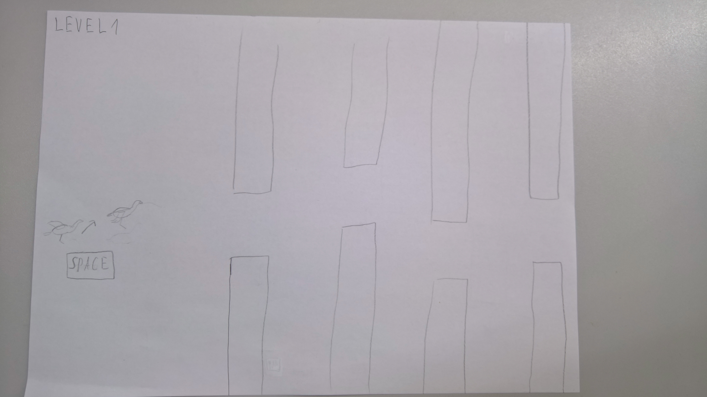
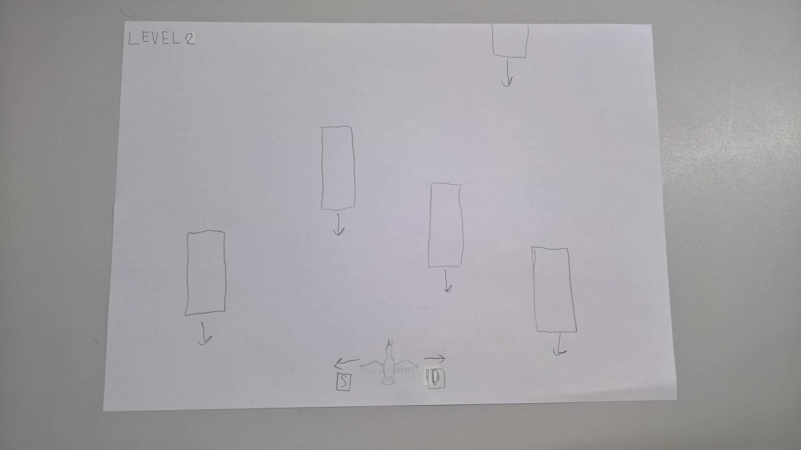

## CustomFlappyBird
Gra w której klikając sprawiamy że tytułowy ptaszek podskakuje. Najego trasie pojawiają się przeszkody. By poruszać się dalej musi omijać przeszkody. Gra kończy się po osiągnieciu danego poziomu (wygrana) lub kolizi z przeszkodą(przegrana). W grze prawdopodobnie pojawią się jakiś alternatywny poziom (nie jest to pewne).
Założenia:
- [x] flappy bird,
- [ ] dodatkowe poziomy,
>Wszystkie praw autorskie należą do ich prawowitego właściciela. To jest projekt na zaliczenie

### Klasy 
- cBird
- cObstacle

### Sterowanie
- Poziom I - przyciskanie spacji powoduje podskakiwanie tytułowego ptaka. Gracz powinien podskakiwać w taki sposób by nie doprowadzić do kolizi z przeszkodami.

- Poziom II - przycicki D i S powodują przesuwanie ptaka odpowiednio prawo i lewo. Gracz powinien podskakiwać w taki sposób by nie doprowadzić do kolizi z przeszkodami.

